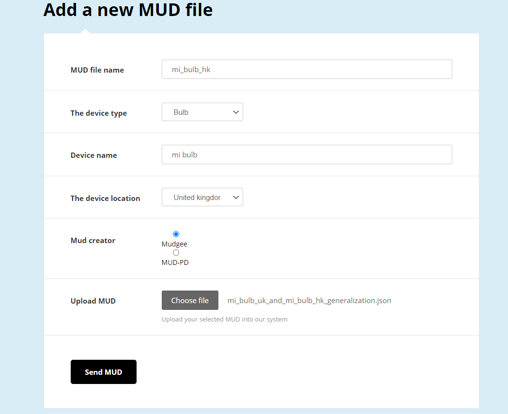

# MUDIS
MUD Inspection System tool that compares the network behavior of devices, based on their formal description in the MUD file
MUDIS tool introduces comparison and generalization features, allowing users to investigate MUD files differences.

Motivated by the impact of location on the MUD, we built
the MUDIS tool, which gets two MUDs as input and performs
two tasks:

* MUD Comparison - calculates the MUD similarity measure. It then examines the differences between two MUD
files and highlights similar entries. This allows us to drill
down and gain insights about the origin of the differences.
* MUD Generalization - creates a generalized MUD that
can serve as a white-list for the network behavior of both
MUDs (represent two locations in our experiments), this
is done by covering both input MUDs.

<b>ADD A NEW MUD</b>

- bla
- bla2
  
This is a basic feature that gives researchers the option to add MUDS into the system. 
The uploaded MUD is then saved at the server and in a dedicated MongoDB for further use. 
When adding a new MUD you can add some helpful metadata like - device name, device type, the device geolocation etc.

|  | 
|:--:| 
| *Add a new MUD screen - gives users the ability to add new generated MUDs into the system for further investigation* |

|  | 
|:--:| 
| *MUDIS main screen - gives users the ability to choose two MUDs and to compare and generalize them using the system* |

|  | 
|:--:| 
| *MUDIS Xioami ligth bulb comapre - compare two Xioami MUDs and get profound insights over thier network behaviour and communication diffrences* |

|  | 
|:--:| 
| *MUDIS YI smart camera comapre - compare two YI MUDs and get profound insights over thier network behaviour and communication diffrences* |
